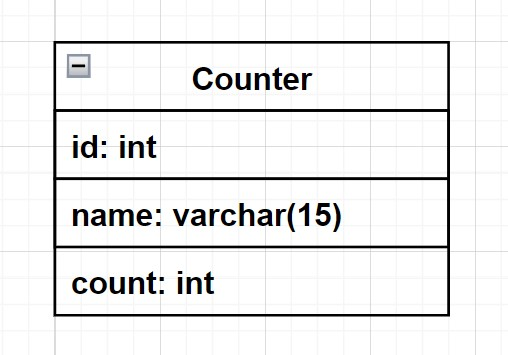

# Counter rest api (java)
Простое REST API приложение с взаимодействием с базой данных MySQL. 

Технологии: **java, Spring Boot, MySQL, HTTP, Docker**.
  

### Описание работы приложения:

В базе данных хранятся счетчики. Через http-запросы к приложению мы можем:
- посмотреть все счетчики (ответ на запрос будет в формате JSON),
- посмотреть значение определенного счетчика по id (ответ на запрос будет в формате значения int),
- увеличить значение счетчика на какое-то значение (запрос в формате JSON, ответ в формате int - новое получившееся число).

Структура БД:

   

### Пример работы приложения:

1. Запрос для доступа к списку счетчиков:

   `curl --location --request GET 'http://localhost:8080/api/counters'`
    
   Ответ на запрос будет в слеующем виде:

   `[{ "id": 1, "name": "First counter", "count": 15 },
    {"id": 2, "name": "Second counter", "count": 1 }, 
    {"id": 3, "name": "Third counter", "count": 1 }]`

2. Запрос для получения текущего значения счетчика по id, например id=1:

   `curl --location --request GET 'http://localhost:8080/api/counter/1'`
    
   Ответ на запрос будет в слеующем виде int: `15`.

3. Запрос для увеличения значения счетчика на какое-то кол-во. Например, меняем счетчик с id=1 на кол-во=5:
   `curl --location --request POST 'http://localhost:8080/api/counter' \
   --header 'Content-Type: application/json' \
   --data-raw '{
   "counterId":"1",
   "incrementCount":5
   }'`
    
   Если изначальное значение счетчика было 15, то его новое значение будет равно 20.
   В ответе на запрос мы получим как раз новое значение int: `20`.

   
   